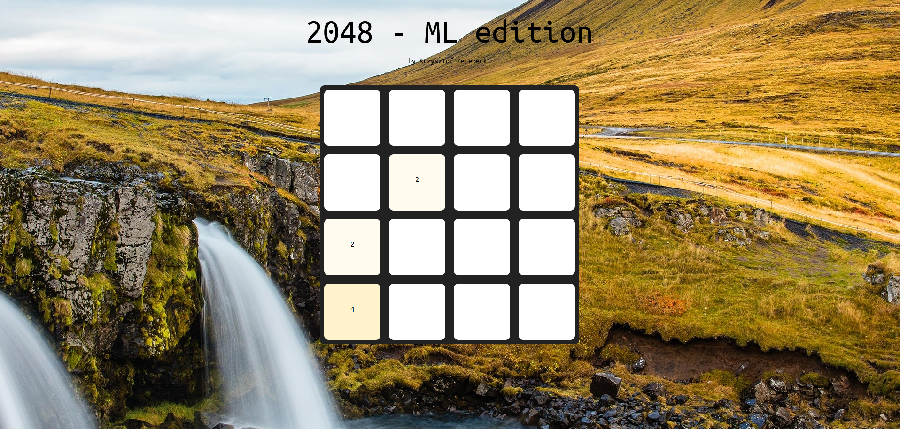
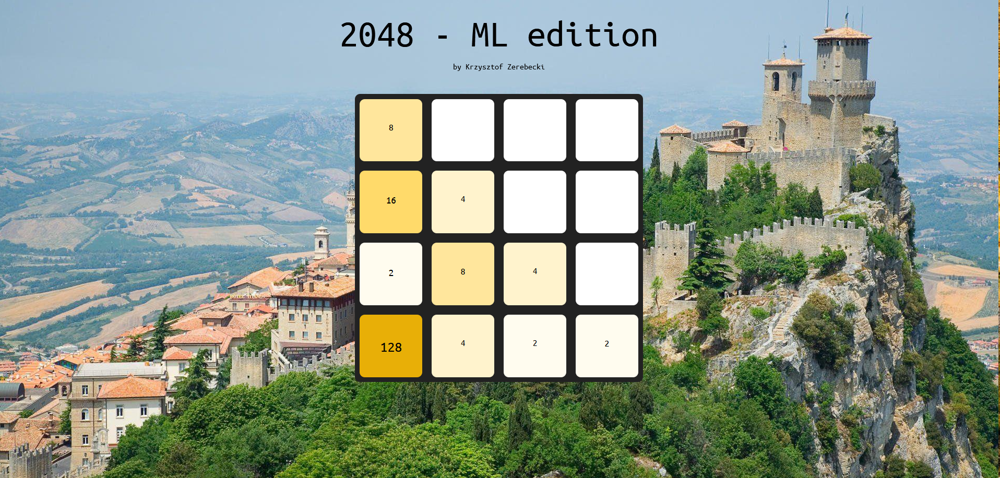
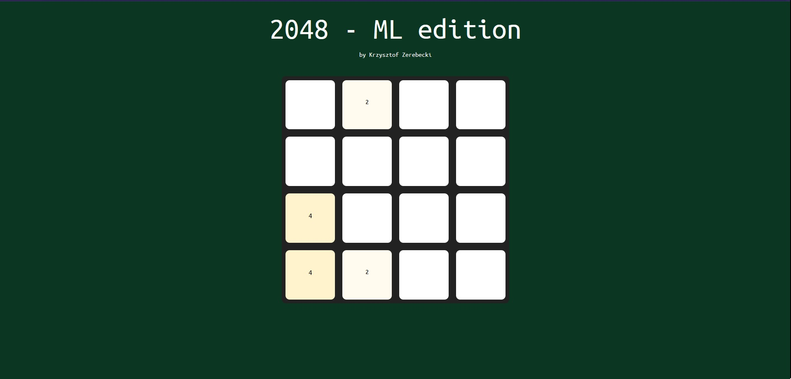
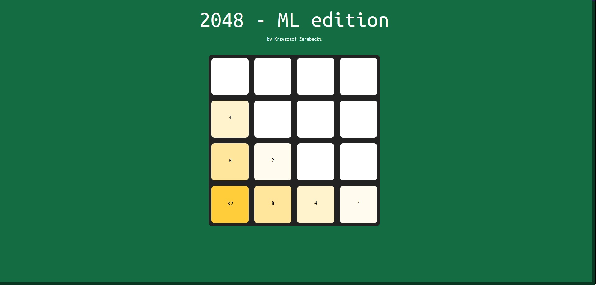
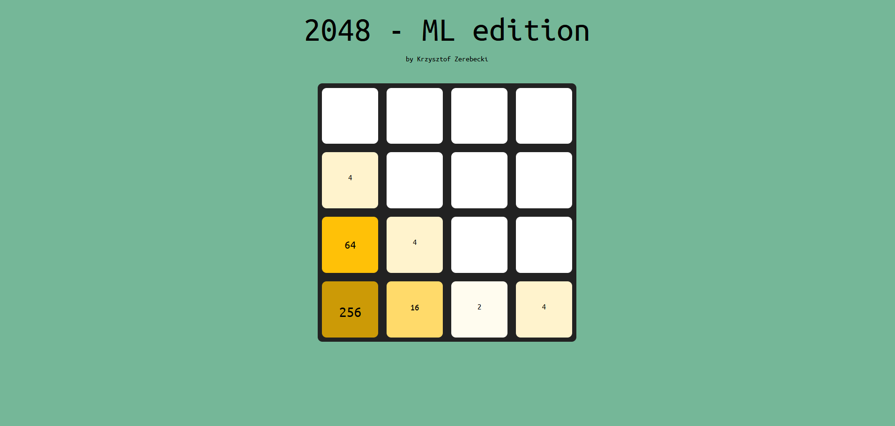

# machine_learning_project_2023

## 2048 implementation v 1.0.0

### Authors:
- [@Krzychu-Z](https://github.com/Krzychu-Z)

## Setup instruction
- [x] Download this repository
- [x] Run client_2048.py
- [x] Enjoy custom 2048 by launching 2048_index.html ;)

## Biomes edition (current)
Background image changes for each top value in the game.
Discover the beauty of the World while merging power-of-2 blocks.

### Sample levels:
#### Tundra (4)

#### Oceanic climate (32)

#### Humid subtropical climate (128)

## Minimal edition
Plain game UI based on green gradient that contrasts perfectly with golden tiles.

### Sample levels:
#### Initial board (0)

#### 4 level

#### 32 level

#### 256 level

#### 1024 level

## Technical documentation
Game works using websockets defined in Python websockets module.\
Websocket receives game board that is 2D array of ints and performs one swipe.\
Websocket from backend of this game can easily be used in ML purposes, since it works on standard 2D arrays.

More details can be found inside the code.

Websocket address: ws://localhost:8765

## Known bugs:
- Game incorrectly assumes losing scenario

