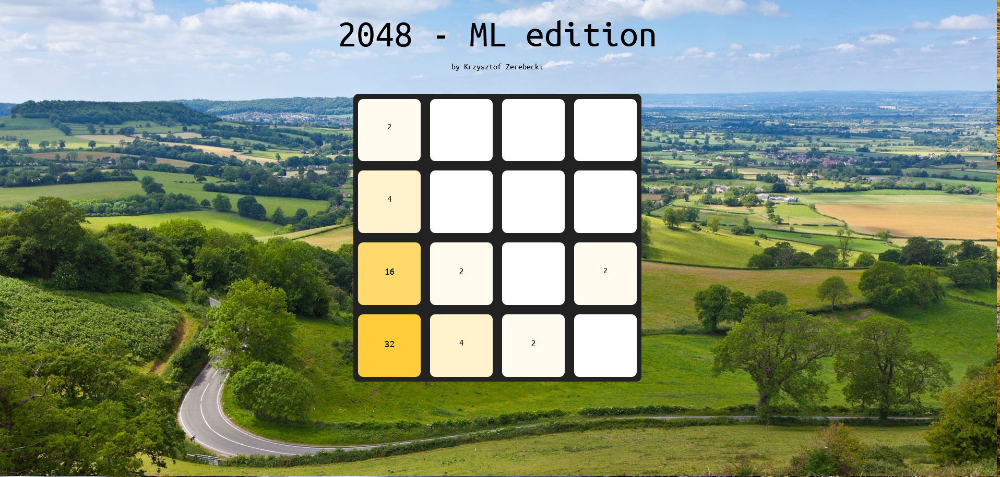

# machine_learning_project_2023

## 2048 implementation v 1.0.0

### Authors:
- [@Krzychu-Z](https://github.com/Krzychu-Z)

## Setup instruction
- [x] Download this repository
- [x] Download required Python packages using pip and requirements.txt
- [x] Run client_2048.py
- [x] Enjoy custom 2048 by launching 2048_index.html ;)

## The Seasons edition (v 1.1)
Background image changes for each top value in the game.
This edition is to celebrate the ever-changing World!

In this update:
- now game correctly tells if user has lost or won
- now win/lose messages have proper colors
- tiles have now wider range of colors
- font inside tiles is same sized and well centered
- new backgrounds minimise the effect of swapping images

## Biomes edition (v 1.0)
Background image changes for each top value in the game.
Discover the beauty of the World while merging power-of-2 blocks.

### Sample levels:
#### Tundra (4)

#### Oceanic climate (32)

#### Humid subtropical climate (128)

## Technical documentation
Game works using websockets defined in Python websockets module.\
Websocket receives game board that is 2D array of ints and performs one swipe.\
Websocket from backend of this game can easily be used in ML purposes, since it works on standard 2D arrays.

More details can be found inside the code.

Websocket address: ws://localhost:8765

## Known bugs:
